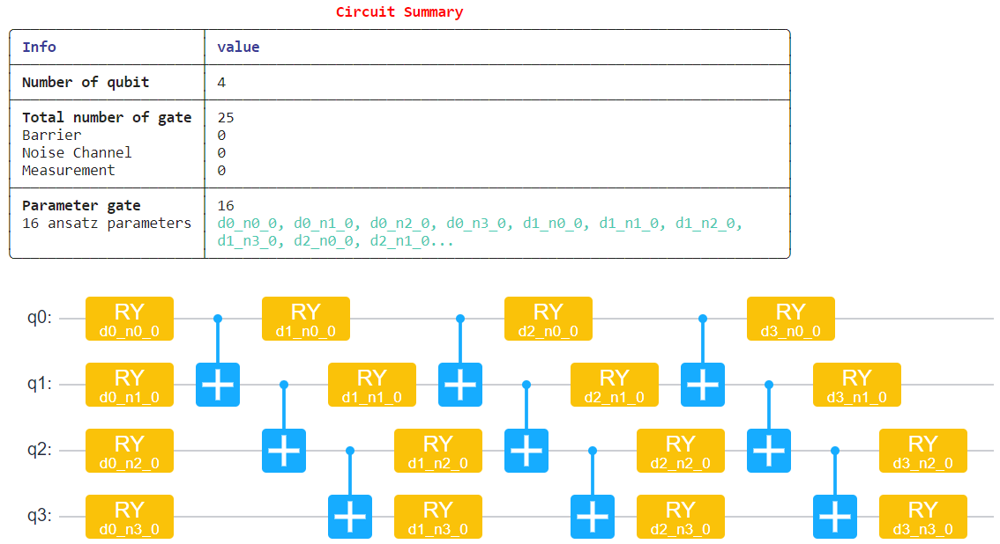
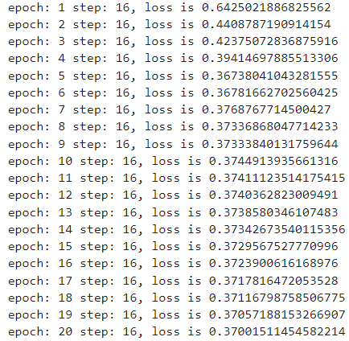
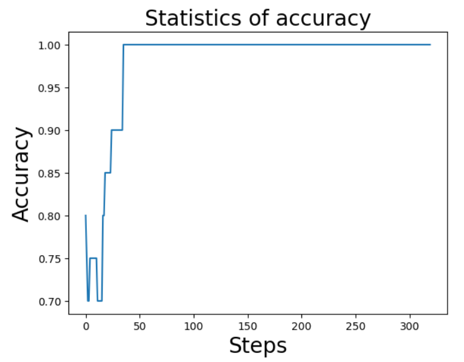
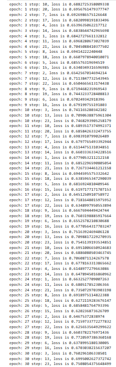
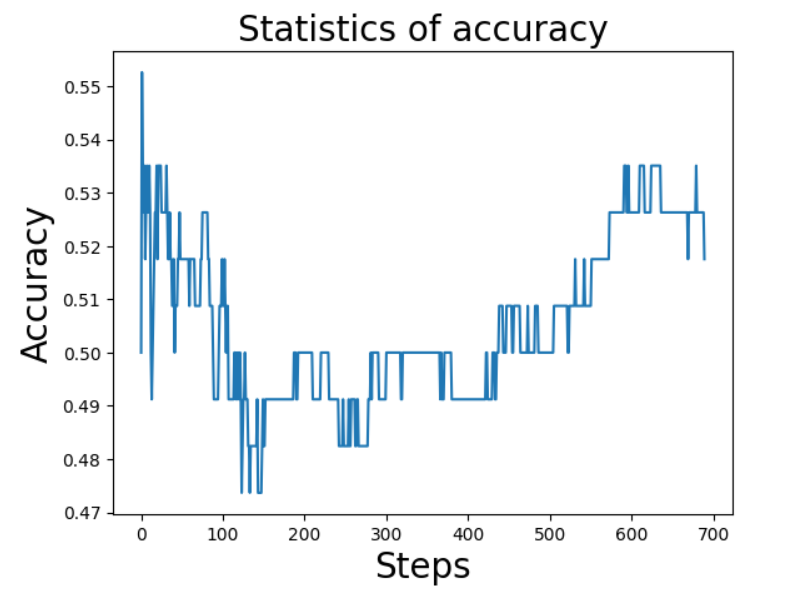

# QCNN_MindQuantum

This project is an implementation of Quantum Convolutional Neural Networks (QCNN) for two datasets:
1) The Iris Dataset (classification of flowers based on features like sepal length/width and petal length/width)
2) The Breast Cancer Dataset (binary classification of malignant vs. benign samples)

The project leverages the MindQuantum library for encoding classical data into quantum circuits and implementing hybrid quantum-classical neural networks. The work was completed as part of the Value-Added Course on Quantum Machine Learning (VAC2406) at VIT Chennai, in collaboration with KwantamG Research Labs. The certificate obtained can be viewed using this link - 
https://drive.google.com/file/d/1lN0stxT-zBLMyGxbWd_7DCeLTd5Pnq88/view?usp=sharing

# QCNN FOR IRIS DATASET
### 1. VISUALIZATION AND PREPROCESSING

The IRIS dataset contains 150 samples, each with four features: sepal length, sepal width, petal length, and petal width. These features are used to classify the samples into three categories: setosa, versicolor, and virginica. For simplicity, only the first 100 samples are selected, focusing on a binary classification problem between setosa (class 0) and versicolor (class 1). The dataset is visualized through scatter plots to analyze feature relationships and class separability, with clear distinctions observed in specific feature pairs. To enhance learning, new features are generated by multiplying overlapping features, increasing the total features from 4 to 7. This feature engineering step enriches the dataset, preparing it for the quantum machine learning pipeline.

### 2. ENCODER

The encoder is a crucial component in the quantum machine learning pipeline, responsible for mapping classical data into a quantum state using a quantum circuit. In this implementation, the Instantaneous Quantum Polynomial (IQP) encoding method is used to transform the classical features into quantum parameters. The circuit is built using the mindquantum library, starting with the initialization of four qubits. Each qubit is first applied with a Hadamard (H) gate to create a superposition state.

Next, a series of parameterized rotations (RZ) are applied to the qubits, with each rotation corresponding to a feature of the input data. These parameters, represented as alpha_i, encode the classical data into the quantum circuit. Additional entanglements are introduced by applying controlled X gates between adjacent qubits, further followed by another set of RZ rotations to capture more complex interactions between the features.

Finally, the encoder circuit is configured to be non-trainable (no_grad) since its primary role is to serve as a feature encoding layer. The summary() and svg() methods are used to generate a textual and visual representation of the circuit, highlighting its structure, number of qubits, and gates used. This encoder effectively prepares the classical features for further quantum processing in the ansatz stage of the quantum neural network.

### 3. QUANTUM NEURAL NETWORK

The ansatz, representing the trainable component of the quantum circuit, is constructed using a Hardware-Efficient Ansatz with four qubits. Each qubit undergoes parameterized rotations (RY gates) and entangling operations (X gates) to capture complex relationships between features, with configurable depth for increased expressiveness. The quantum circuit is completed by combining the encoder, which maps classical data to quantum states, with the ansatz, enabling both feature encoding and trainable parameters for optimization. The Hamiltonian, constructed using Pauli-Z operators on specific qubits, defines the measurable quantities for training by calculating expectation values. These values serve as outputs for comparison with actual labels. Finally, a hybrid Quantum Neural Network (QNN) is built by integrating the completed circuit and Hamiltonian into the MindQuantum MQLayer, enabling efficient training through gradient computations on a quantum simulator. This hybrid approach leverages quantum circuits for feature learning while optimizing parameters using classical methods.

### 4. TRAINING AND RESULTS

The training process for the Quantum Convolutional Neural Network (QCNN) involves using the MindSpore framework. The quantum neural network is trained using the Adam optimizer and a softmax cross-entropy loss function. The dataset is split into training and testing sets, and during training, the loss decreases steadily, demonstrating effective learning. The final model achieves 100% accuracy on the test set, showcasing the capability of QCNNs for binary classification.

To compare the performance, a classical Convolutional Neural Network (CNN) is implemented using TensorFlow. The CNN is designed with convolutional, pooling, and dense layers. After training on the same dataset, the CNN also achieves 100% accuracy on the test set. However, the QCNN exhibits faster convergence during training, leveraging the quantum encoding to capture feature relationships more efficiently. This comparison highlights that while both models achieve similar accuracy, the QCNN demonstrates the potential of hybrid quantum-classical models to perform competitively, especially in scenarios where quantum hardware capabilities can offer advantages like reduced computational overhead for complex feature spaces.

# QCNN FOR BREAST CANCER DATASET

### 1. VISUALIZATION AND PREPROCESSING

The Breast Cancer dataset consists of 569 samples with 30 features extracted from digitized images of breast masses, used for binary classification between malignant (class 0) and benign (class 1). Four features (mean radius, mean texture, mean perimeter, and mean area) out of the 30 were selected for simplicity, and additional features were created by multiplying overlapping ones, increasing the total features to 7. The data was split into training and testing sets (80:20). Visualization through scatter plots showed class separability across feature pairs, aiding in understanding feature importance for classification. 

### 2. QUANTUM NEURAL NETWORK AND TRAINING

The Quantum Neural Network (QNN) for the Breast Cancer dataset follows the same approach as the Iris dataset. The encoder uses Instantaneous Quantum Polynomial (IQP) encoding to map classical features to quantum states. A Hardware-Efficient Ansatz with parameterized rotations and entanglements is added to complete the quantum circuit. The Hamiltonian, defined using Pauli-Z operators, calculates expectation values as outputs.

The QNN is integrated into the MindQuantum MQLayer and trained using the Adam optimizer and a softmax cross-entropy loss function. The dataset is split into training and testing sets, with the training process monitored for accuracy and loss. As in the Iris dataset, the hybrid quantum-classical model leverages quantum encodings for efficient learning while using classical backpropagation for optimization.

### 3. RESULTS

The Quantum Neural Network (QNN) for the Breast Cancer dataset achieved an accuracy of approximately 51%, while the classical CNN achieved a significantly higher accuracy of 98%. This performance gap can largely be attributed to the limited number of features used in the QNN. Only four features were selected for encoding, whereas the CNN utilized all 30 features, allowing it to leverage a more comprehensive representation of the dataset. The decision to use only four qubits in the QNN was deliberate, as it highlights a key limitation of quantum neural networks: as the number of features increases, the complexity of the quantum circuit grows exponentially, requiring significantly more computational resources and powerful quantum systems. This approach was intended to test the scalability of QNNs under constrained feature and hardware settings.

To improve the QNN’s performance, future implementations could incorporate more features into the encoding process, use additional qubits to handle higher-dimensional data, or optimize the quantum circuit design to better capture feature relationships. However, these improvements depend heavily on advancements in quantum hardware to handle the increased computational demands. This experiment highlights the challenges and potential of QNNs, emphasizing the importance of balancing feature selection and computational feasibility in quantum machine learning.
