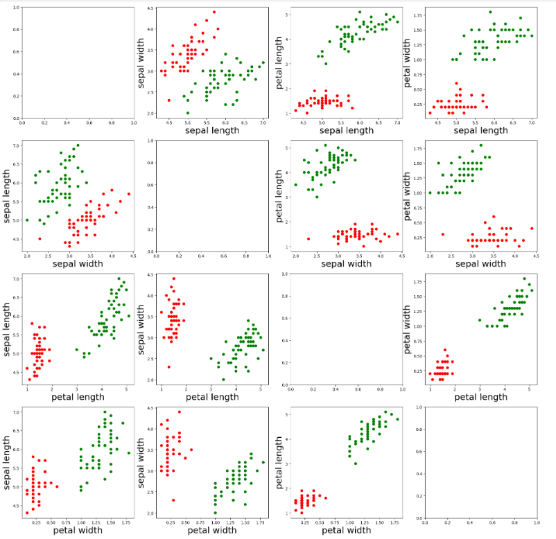
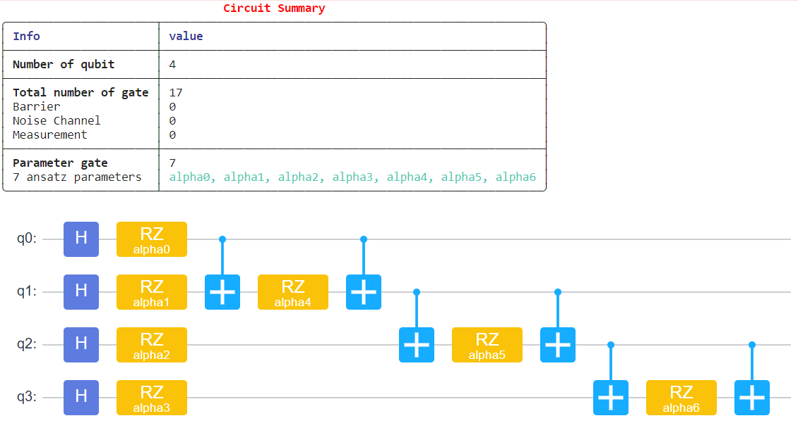

# QCNN_MindQuantum

This project is an implementation of Quantum Convolutional Neural Networks (QCNN) for two datasets:
1) The Iris Dataset (classification of flowers based on features like sepal length/width and petal length/width)
2) The Breast Cancer Dataset (binary classification of malignant vs. benign samples)

The project leverages the MindQuantum library for encoding classical data into quantum circuits and implementing hybrid quantum-classical neural networks. The work was completed as part of the Value-Added Course on Quantum Machine Learning (VAC2406) at VIT Chennai, in collaboration with KwantamG Research Labs. The certificate obtained can be viewed using this link - 
https://drive.google.com/file/d/1lN0stxT-zBLMyGxbWd_7DCeLTd5Pnq88/view?usp=sharing

# QCNN FOR IRIS DATASET
## 1.VISUALIZATION AND PREPROCESSING

The IRIS dataset contains 150 samples, each with four features: sepal length, sepal width, petal length, and petal width. These features are used to classify the samples into three categories: setosa, versicolor, and virginica. For simplicity, only the first 100 samples are selected, focusing on a binary classification problem between setosa (class 0) and versicolor (class 1). The dataset is visualized through scatter plots to analyze feature relationships and class separability, with clear distinctions observed in specific feature pairs. To enhance learning, new features are generated by multiplying overlapping features, increasing the total features from 4 to 7. This feature engineering step enriches the dataset, preparing it for the quantum machine learning pipeline.

## 2. ENCODER

The encoder is a crucial component in the quantum machine learning pipeline, responsible for mapping classical data into a quantum state using a quantum circuit. In this implementation, the Instantaneous Quantum Polynomial (IQP) encoding method is used to transform the classical features into quantum parameters. The circuit is built using the mindquantum library, starting with the initialization of four qubits. Each qubit is first applied with a Hadamard (H) gate to create a superposition state.

Next, a series of parameterized rotations (RZ) are applied to the qubits, with each rotation corresponding to a feature of the input data. These parameters, represented as alpha_i, encode the classical data into the quantum circuit. Additional entanglements are introduced by applying controlled X gates between adjacent qubits, further followed by another set of RZ rotations to capture more complex interactions between the features.

Finally, the encoder circuit is configured to be non-trainable (no_grad) since its primary role is to serve as a feature encoding layer. The summary() and svg() methods are used to generate a textual and visual representation of the circuit, highlighting its structure, number of qubits, and gates used. This encoder effectively prepares the classical features for further quantum processing in the ansatz stage of the quantum neural network.
